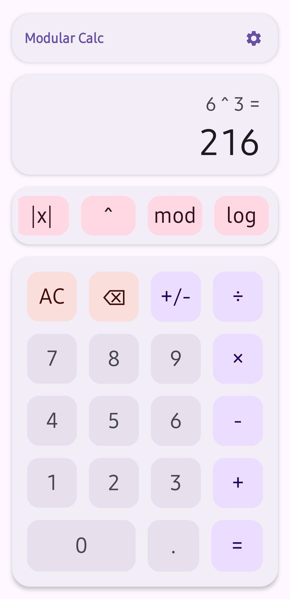
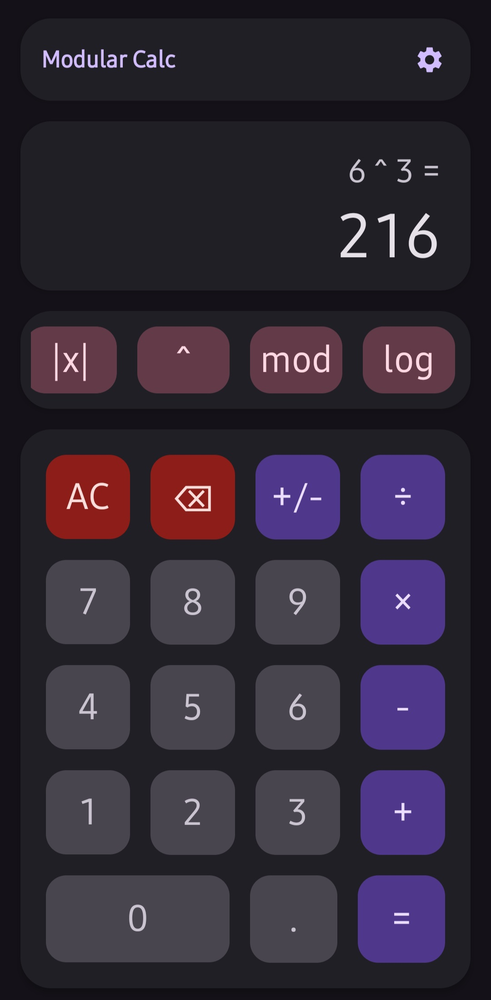
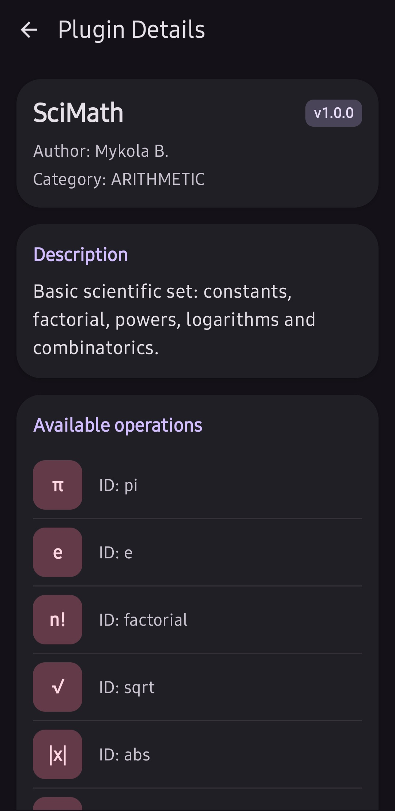

# Plugin Calculator

[](https://github.com/mykola-b31/plugin-calculator/actions/workflows/android-ci.yml)
[](LICENSE)


An Android calculator app that supports **installable plugins** — custom operations written in **Lua** and packaged as `.calcpkg` files, loaded and executed on-device without recompiling the app.

> **Status: in active development.** Core calculator, plugin loading/execution pipeline, and security hardening are implemented and tested. UI polish and a public plugin catalog are planned next.

## Why this project

Most calculator apps hardcode every operation. This one treats operations as installable packages (.calcpkg), so anyone can extend the calculator — add a statistics function, a geometry formula, a unit converter — by writing a small Lua script and a manifest, without forking or rebuilding the app. Building this required solving problems that go beyond a typical CRUD/UI app: sandboxing untrusted code, validating untrusted archives, and keeping UI state consistent while plugins are installed, removed, or fail at runtime.

## Features

- Standard calculator with `BigDecimal`-based arithmetic for exact precision (no floating-point rounding surprises)
- Install plugins from `.calcpkg` archives (a manifest + a Lua script) directly from the file picker
- Plugins can declare nullary, unary, or binary operations, grouped by category (arithmetic, trigonometry, algebra, matrices, graphs, statistics, geometry)
- Plugin manager screen: browse, inspect, and remove installed plugins
- Reactive UI built with Jetpack Compose and `StateFlow` — installing/removing a plugin updates the calculator keyboard immediately

## 📸 Screenshots

<table>
  <tr>
    <td align="center"><br/><sub>Light theme</sub></td>
    <td align="center"><br/><sub>Dark theme</sub></td>
    <td align="center"><br/><sub>Plugin manager</sub></td>
    <td align="center"><br/><sub>Plugin detail</sub></td>
  </tr>
</table>


## Project Structure

* `core/data`: Contains data models (`Plugin`, `CalculationResult`) and the `PluginRepository` for managing plugin states.
* `core/plugin`: The heart of the app. Handles ZIP extraction, manifest parsing, script validation, and the Lua sandbox execution.
* `ui/calculator`: Contains the main calculator screen and its corresponding state management.
* `ui/plugins`: Screens and ViewModels dedicated to the Plugin Manager and detailed plugin views.
* `ui/components`: Reusable Compose UI elements (e.g., `IslandCard`, `CalculatorButton`).

## Security model

Since plugin code comes from an untrusted `.calcpkg` archive, the app treats it as hostile by default:

- **Sandboxed Lua runtime.** Plugins run in a [LuaJ](https://github.com/luaj/luaj) environment with `load`, `loadfile`, `dofile`, `require`, `debug`, and `collectgarbage` stripped out — no filesystem, network, reflection, or OS access.
- **Execution time limits.** A custom `DebugLib` hook checks elapsed time every 1000 bytecode instructions and aborts the script if it exceeds the limit, so an infinite loop in a plugin can't hang or freeze the app.
- **Path traversal protection.** Plugin `id` values are validated against a strict `[A-Za-z0-9._-]` pattern (since the id becomes a directory name on disk), and `entryFile` paths are checked to reject `..` segments and absolute paths.
- **Zip bomb protection.** Archive extraction enforces a per-entry size cap, a total uncompressed size cap, and a maximum entry count, so a malicious `.calcpkg` can't exhaust device storage.
- **Version gating.** Each plugin declares a `minAppVersion`; manifests targeting a newer app version than the one installed are rejected with a clear error instead of failing unpredictably at runtime.

## Plugin format

A `.calcpkg` is a zip archive containing a `manifest.json` and a Lua entry file:

```json
{
  "id": "math-utilities",
  "name": "Math Utilities",
  "author": "Your Name",
  "version": "1.0.0",
  "minAppVersion": "1.0.0",
  "description": "Common utility operations",
  "category": "arithmetic",
  "entryFile": "main.lua",
  "operations": [
    { "id": "square", "label": "x²", "inputs": 1 },
    { "id": "average", "label": "avg", "inputs": 2 }
  ]
}
```

The Lua entry file must define an `execute(operation, args)` function. `operation` is the operation id from the manifest, and `args` is a 1-indexed table of numeric arguments:

```lua
function execute(operation, args)
    if operation == "square" then
        return args[1] * args[1]
    elseif operation == "average" then
        return (args[1] + args[2]) / 2
    end
end
```

A plugin can return a plain number, or a table (e.g. `{ type = "matrix", data = {...} }`) for structured results.

> **Note on precision.** The built-in operations (`+ - * /`) use `BigDecimal` throughout and never lose precision. Plugin-computed results, however, pass through Lua's native number type (a 64-bit `double`), so they carry `double`'s ~15-17 significant digit precision rather than `BigDecimal`'s exactness. This is negligible for most operations (trigonometry, statistics, general math) but worth knowing before relying on a plugin for exact decimal arithmetic.

## Architecture

- **UI:** Jetpack Compose, MVVM (`CalculatorViewModel`, `PluginManagerViewModel`, `PluginDetailViewModel`)
- **State:** `PluginRepository` exposes installed plugins as a `StateFlow`, so all screens observe the same reactive source of truth
- **Plugin pipeline:** `ZipArchiveExtractor` → `ManifestParser` → `PluginValidator` → `PluginExecutor` (with `LuaTimeoutRunner` and `LuaSandbox` enforcing the limits above)
- **Persistence:** installed plugins are stored under app-internal storage; no external/shared storage access

## Tech stack

Kotlin · Jetpack Compose · Coroutines & `StateFlow` · LuaJ · kotlinx.serialization · JUnit4 · GitHub Actions CI

## Testing

Unit tests cover the security-sensitive and logic-heavy parts of the app: manifest parsing and validation, path-traversal and zip-bomb guards, plugin execution timeouts, app-version comparison, and the calculator view model. Tests run automatically on every push and pull request via GitHub Actions.

## Building

```bash
git clone https://github.com/mykola-b31/plugin-calculator.git
cd plugin-calculator
./gradlew assembleDebug
```

Requires JDK 21 and Android Studio (or the Gradle wrapper alone for a CLI build).

## Roadmap

- [ ] Ship a small catalog of official reference plugins
- [ ] Declarative "linear conversion" plugin type with native `BigDecimal` precision, bypassing Lua entirely for simple unit-conversion use cases
- [ ] Plugin signing / integrity verification
- [ ] Expanded operation categories (matrices, graphs)
- [ ] UI/UX polish pass on the plugin manager

## License

This project is licensed under the MIT License — see [LICENSE](LICENSE) for details.